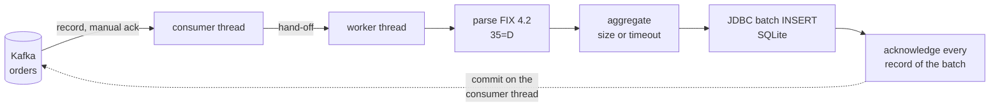
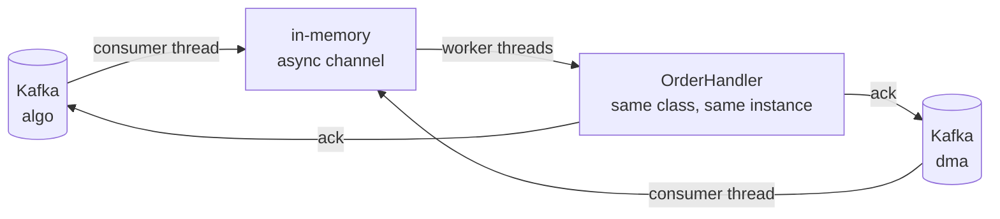

# Spring Integration vs Apache Camel

The same two Kafka / FIX 4.2 use cases, implemented twice: once with **Spring Integration 7.1** and once with
**Apache Camel 4.22**, both on Spring Boot 4.1. The goal is to compare the two frameworks on identical, testable
requirements rather than on feature lists.

| Use case | Spring Integration | Apache Camel |
|---|---|---|
| 1. Kafka → async batch → SQLite batch insert → manual ack after the insert | [`usecase1/spring-integration`](usecase1/spring-integration) | [`usecase1/apache-camel`](usecase1/apache-camel) |
| 2. Kafka `algo` + `dma` → in-memory async hand-off → one handler class → ack back to each topic | [`usecase2/spring-integration`](usecase2/spring-integration) | [`usecase2/apache-camel`](usecase2/apache-camel) |

Everything that is not framework-specific lives in [`common`](common): FIX 4.2 parsing and validation with
QuickFIX/J, the `NewOrder` model, the SQLite schema and SQL, the shared business logic of use case 2, a demo
producer and the Kafka test harness. The framework modules therefore contain only plumbing, which is what is
being compared.

## Layout

```
common/                          FIX parsing, order model, SQLite SQL, OrderProcessor, producer tool, test fixtures
support/spring-kafka-support/    manual-ack listener containers for the Spring Integration demos (~60 lines)
support/camel-kafka-support/     manual commits from any thread for the Camel demos (~330 lines, see below)
usecase1/spring-integration/     Kafka → ExecutorChannel → aggregate → JdbcMessageHandler (batch) → ack
usecase1/apache-camel/           kafka → aggregate (own thread) → sql?batch=true → commit
usecase2/spring-integration/     Kafka ×2 → PublishSubscribeChannel(executor) → OrderHandler → ack
usecase2/apache-camel/           kafka ×2 → seda → OrderHandler → commit
podman-compose.yml               single-node Kafka 4.2 (KRaft) on localhost:9092
scripts/kafka-up.sh, kafka-down.sh
buildSrc/                        Gradle conventions: Java 21, JUnit, the `integrationTest` source set and task
```

## Prerequisites

- JDK 21 or newer to run Gradle (the code is compiled with `--release 21`).
- Podman 5 with the compose provider (`podman compose version` must work). The broker uses port 9092.
- Nothing else: Gradle comes from the wrapper, Kafka from `podman-compose.yml`, SQLite is embedded.

## Build and test

| Command | What it does |
|---|---|
| `./gradlew build` | Compiles everything and runs the unit tests. No Kafka needed. |
| `./gradlew integrationTest` | Starts Kafka with `podman compose` (task `kafkaUp`, idempotent), then runs the four end-to-end tests. |
| `./gradlew kafkaUp` / `./gradlew kafkaDown` | Start / remove the broker. `scripts/kafka-up.sh` blocks until the broker answers. |

The end-to-end tests live in `src/integrationTest` of each framework module and boot the real application with
`@SpringBootTest` against the real broker. Every run uses fresh topic and consumer-group names, so runs never
interfere with each other. They assert on facts, not on mocks:

- rows in the SQLite file and the absence of duplicates (use case 1),
- the consumer group's committed offsets, read with the Kafka admin client, equal to the number of records
  including the poison ones,
- batch statistics (several records per insert, fewer inserts than records),
- the names of the threads that ran the handler (never a Kafka consumer thread, use case 2),
- the poison-message policy: a non-order FIX message and plain garbage are logged, skipped and acknowledged.

Tests annotated with `@RequiresKafka` are skipped with an explanation when the broker is not reachable.

## Run the demos

```bash
./gradlew kafkaUp
```

```bash
./gradlew :usecase1:spring-integration:bootRun
```

Any of the four modules works the same way (`:usecase1:apache-camel`, `:usecase2:spring-integration`,
`:usecase2:apache-camel`). `./gradlew bootJar` also produces runnable jars such as
`usecase1/spring-integration/build/libs/usecase1-spring-integration-0.1.0.jar`.
The use case 1 apps write `./usecase1-<framework>.db` in their working directory; override it with
`--fixflow.db.path=/somewhere/orders.db`.

Publish orders with the demo producer (every 50th message gets a broken checksum here):

```bash
./gradlew :common:sendOrders -Ptopic=orders -Pcount=200 -PinvalidEvery=50
```

For use case 2 publish to `algo` and `dma` instead. Then look at the application log, the database and the
committed offsets:

```bash
sqlite3 usecase1/spring-integration/usecase1-spring-integration.db 'select count(*), min(inserted_at), max(inserted_at) from orders'
```

```bash
podman exec fixflow-kafka /opt/kafka/bin/kafka-consumer-groups.sh --bootstrap-server localhost:9092 --describe --group uc1-spring-integration
```

Configuration is plain Spring Boot properties: `FIXFLOW_KAFKA_BOOTSTRAP` (default `localhost:9092`),
`fixflow.orders.*` for use case 1 (`topic`, `group-id`, `batch-size`, `batch-timeout`, `concurrency`) and
`fixflow.sources.*` for use case 2 (`algo-topic`, `dma-topic`, `group-id`, `handler-threads`, `concurrency`).

## Use case 1: batch insert with acknowledgment after the insert



| Step | Spring Integration ([`OrdersFlowConfiguration`](usecase1/spring-integration/src/main/java/com/fixflow/usecase1/si/OrdersFlowConfiguration.java)) | Apache Camel ([`OrdersRoute`](usecase1/apache-camel/src/main/java/com/fixflow/usecase1/camel/OrdersRoute.java)) |
|---|---|---|
| Consume | `Kafka.messageDrivenChannelAdapter(container)` on a `ConcurrentMessageListenerContainer` with `AckMode.MANUAL` and `asyncAcks=true` | `from("kafka:orders?allowManualCommit=true&autoCommitEnable=false&...")` |
| Hand off to another thread | `.channel(MessageChannels.executor(...))`, single-thread executor | the aggregator's own executor (`.parallelProcessing().executorService(...)`), single thread |
| Parse | `.handle(String.class, parser::parseNewOrderSingle, e -> e.advice(...))` | `.process(...)` on the consumer thread |
| Batch | `.aggregate(...)` with a constant correlation key, `releaseStrategy(size)`, `groupTimeout`, `sendPartialResultOnExpiry`, `expireGroupsUponCompletion`, custom `outputProcessor` | `.aggregate(constant(true), new GroupedExchangeAggregationStrategy()).completionSize(n).completionTimeout(ms)` |
| Insert | `JdbcMessageHandler`, which issues one JDBC batch update when the payload is an `Iterable` | `.to("sql:INSERT ... :#clOrdId ...?batch=true")` with a `List<Map>` body |
| Ack after insert | `publishSubscribeChannel` with two sequential subscribers: the JDBC handler, then a handler acknowledging every record; the second never runs when the first throws | `.process(...)` after the `sql` endpoint, calling the `CamelKafkaManualCommit` of every record |
| Poison record | `ExpressionEvaluatingRequestHandlerAdvice` (`trapException`, failure channel) around the parse step; a handler on that channel logs and acknowledges | `onException(FixParseException.class).handled(true).process(...)` logs and commits |

Both implementations insert with `INSERT OR IGNORE` on a unique `(sender_comp_id, cl_ord_id)` index, so a batch
that is redelivered after a crash (at-least-once) does not create duplicates.

A step-by-step walkthrough of the Spring Integration flow, with diagrams of the beans, channels, threads and headers,
is in [usecase1/spring-integration/.../si/README.md](usecase1/spring-integration/src/main/java/com/fixflow/usecase1/si/README.md).

## Use case 2: two topics, one handler, acknowledgment per topic



| Step | Spring Integration ([`OrderSourcesConfiguration`](usecase2/spring-integration/src/main/java/com/fixflow/usecase2/si/OrderSourcesConfiguration.java)) | Apache Camel ([`OrderSourcesRoutes`](usecase2/apache-camel/src/main/java/com/fixflow/usecase2/camel/OrderSourcesRoutes.java)) |
|---|---|---|
| Consume | two manual-ack containers, one flow each, both ending in `.channel("orders")` | two `from("kafka:...")` routes, both ending in `.to("seda:orders")` |
| Async in-memory hand-off | `PublishSubscribeChannel` backed by a `ThreadPoolTaskExecutor` (`uc2-handler-*` threads) | `seda:orders?concurrentConsumers=4` (`blockWhenFull=true` on the producers for back-pressure) |
| Handler | [`OrderHandler implements MessageHandler`](usecase2/spring-integration/src/main/java/com/fixflow/usecase2/si/OrderHandler.java) | [`OrderHandler implements Processor`](usecase2/apache-camel/src/main/java/com/fixflow/usecase2/camel/OrderHandler.java) |
| Ack to the right topic | the `kafka_acknowledgment` header belongs to the container that received the record | the `CamelKafkaManualCommit` header belongs to the consumer that received the record |

Both handlers delegate to the framework-neutral [`OrderProcessor`](common/src/main/java/com/fixflow/common/orders/OrderProcessor.java)
from `common`, so the only difference between them is how the acknowledgment is expressed.

## The one big difference: acknowledging from another thread

Both use cases acknowledge a record on a thread other than the Kafka consumer thread, after asynchronous work.
A `KafkaConsumer` is single-threaded by contract, so the frameworks have to bridge that gap.

**Spring Kafka has it built in.** `ContainerProperties.setAsyncAcks(true)` together with `AckMode.MANUAL` lets
`Acknowledgment.acknowledge()` be called from any thread and in any order. The container queues the
acknowledgments, commits a partition only up to its first unacknowledged offset, and pauses the consumer while
acknowledgments of the last poll are outstanding, which gives natural back-pressure. `support/spring-kafka-support`
is a 60-line helper that just configures this.

**Camel 4.22 does not.** The Kafka component's documentation states that records must be processed and committed
by the consumer thread and that asynchronous EIPs make the commit fail with `ConcurrentModificationException`
("Note 1" in the manual-commit section). The `DefaultKafkaManualAsyncCommitFactory` still exists, and the docs
still say it commits "in the next consumer loop", but in the 4.22 sources `commit()` calls `consumer.commitAsync`
directly on the calling thread. So the equivalent had to be built:
[`support/camel-kafka-support`](support/camel-kafka-support/src/main/java/com/fixflow/support/camel) plugs into two
public extension points of the Kafka component:

- a `KafkaClientFactory` that wraps every consumer in a dynamic proxy ([`DeferredCommitConsumer`](support/camel-kafka-support/src/main/java/com/fixflow/support/camel/DeferredCommitConsumer.java));
  the proxy remembers the offsets returned by `poll()`, and before every `poll()`, `unsubscribe()` and `close()`
  (all consumer-thread calls) commits each partition up to its first unacknowledged record;
- a `KafkaManualCommitFactory` whose `KafkaManualCommit.commit()` only marks the record as acknowledged in a
  concurrent set, so it is safe from any thread.

This gives the Camel demos the same contiguous-offset, at-least-once semantics as Spring Kafka's `asyncAcks`. The
first version of it committed "the highest acknowledged offset per partition" and the integration test caught the
consequence within minutes: a poison record skipped on the consumer thread was committed ahead of a batch still in
flight, and a later commit moved the offset backwards. That is the kind of subtlety a framework should own.

## Other observations from building this

Spring Integration

- The DSL is very explicit about threading: every hand-off is a visible channel (`ExecutorChannel`,
  `PublishSubscribeChannel(executor)`), which makes the "which thread runs this" question easy to answer.
- The aggregator needs four settings to behave like a batcher (`releaseStrategy`, `groupTimeout`,
  `sendPartialResultOnExpiry`, `expireGroupsUponCompletion`), and `expireGroupsUponCompletion(true)` is easy to
  forget with a constant correlation key.
- Error handling per endpoint is done with an advice and a failure channel. A transformer must always reply, so the
  parse step that may drop a poison record has to be a service activator with `requiresReply(false)`.
- Spring Boot's integration auto-configuration tries to initialise the JDBC message-store schema as soon as a
  `DataSource` exists and fails for SQLite; `spring.integration.jdbc.initialize-schema=never` is required.
- `JdbcMessageHandler` batches an `Iterable` payload, but mapping records to named parameters needs
  `usePayloadAsParameterSource(true)` and a `SqlParameterSourceFactory`.

Apache Camel

- The route reads like the requirement: `from(kafka).process(parse).aggregate(...).to(sql).process(commit)`.
  Batching by size or timeout is two calls; the SQL component does the batch when told `batch=true`.
- Threading is implicit: the aggregator runs on the calling thread unless `parallelProcessing`/`executorService`
  is set, and `completionTimeoutCheckerInterval` (1 s by default) bounds how late a timeout fires.
- The SQL statement lives in an endpoint URI, so whitespace has to be collapsed and parameters use `:#name`
  rather than Spring's `:name`.
- Camel Spring Boot auto-wires single beans of `KafkaClientFactory` and `KafkaManualCommitFactory` into the
  component; the demos reference them explicitly with `#bean:` anyway. `camel-spring-boot-bom` manages only the
  starters, the core `camel-bom` is needed for `camel-kafka` itself.
- `onException(...).handled(true)` is the simplest poison-message policy of the two.

Common ground

- Both run as Spring Boot applications with identical configuration style, identical tests and the same shared code,
  so the comparison is about the integration layer only.
- Neither framework batches JDBC inserts differently in effect: both end up in one `PreparedStatement.executeBatch()`
  per batch.
- Both poison-message policies acknowledge the bad record so that it cannot block its partition forever.

## Versions

| Component | Version |
|---|---|
| Spring Boot | 4.1.1 (Spring Framework 7.0.9) |
| Spring Integration / Spring Kafka | 7.1.1 / 4.1.1 |
| Apache Camel (Spring Boot starters) | 4.22.0 |
| Kafka broker / clients | apache/kafka 4.2.1 / 4.2.1 (Spring), 4.3.1 (Camel) |
| QuickFIX/J | 3.0.2 (`quickfixj-messages-fix42` data dictionary) |
| SQLite JDBC | 3.53.4.0 |
| Gradle | 9.2.1 (wrapper), Java 21 bytecode |

## Further reading

[docs/kafka-manual-ack-and-batching.md](docs/kafka-manual-ack-and-batching.md) records the analysis behind the
manual-acknowledgment design: how Spring Kafka's `asyncAcks` works internally and why it caps a batch at one poll,
what plain `AckMode.MANUAL` changes, how to get bigger JDBC batches, and the equivalent knobs on the Camel side.

## Not covered

- Retries, dead-letter topics and transactions: a failed batch insert stays unacknowledged and is redelivered after
  a restart in both implementations.
- Rebalance edge cases of the Camel deferred-commit proxy are handled only by dropping the state of revoked
  partitions; Spring Kafka's implementation is the battle-tested one.
- Performance: the broker is a single node, SQLite is a single-writer database, and the batch sizes are demo-sized.
