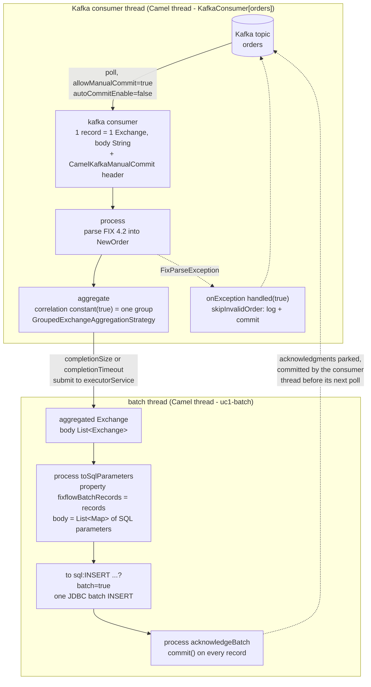
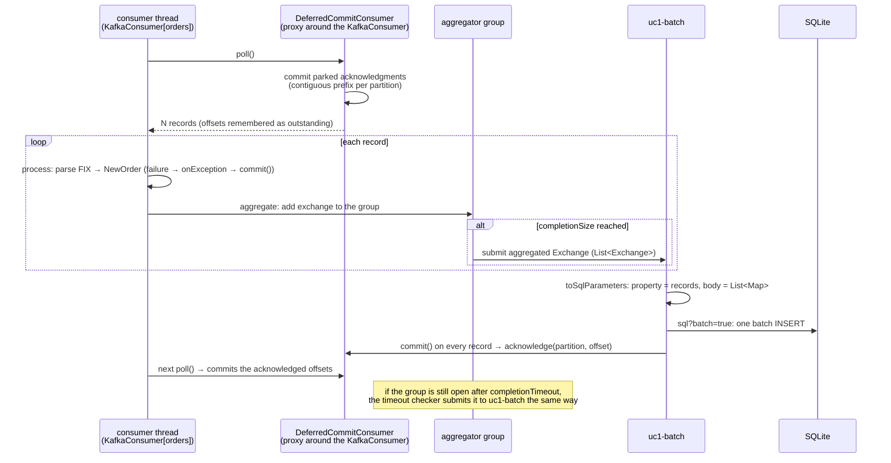

# How `OrdersRoute` builds and runs the route

This module is use case 1 with Apache Camel: FIX orders from Kafka, batched asynchronously, inserted into SQLite
with one JDBC batch, acknowledged to Kafka only after the insert. All of it is wired in
[`OrdersRoute`](src/main/java/com/fixflow/usecase1/camel/OrdersRoute.java). Like its Spring Integration twin
([walkthrough](../spring-integration/README.md)) it works at
two levels:

1. **Build time.** `configure()` runs once at startup. Its fluent calls do not process anything; they append nodes to
   a *route definition*. Camel then turns that definition into a chain of processors and starts the Kafka consumer.
2. **Run time.** An `Exchange` (a message body, headers and exchange properties) travels along that chain, changing
   thread once on the way.

Keep both levels apart while reading and the class becomes simple.

## The picture



Dashed lines are acknowledgments; they do not carry exchanges further along the route.

## Vocabulary you need

| Term | Meaning here |
|---|---|
| `Exchange` | The unit that flows through a route: a message (body + headers), exchange properties, and an exception slot. Processors mutate it in place. |
| Route | `from(endpoint)` followed by processing steps. One consumer feeds one route. |
| Endpoint URI | `component:name?option=value&...`, for example `kafka:orders?groupId=...` or `sql:INSERT ...?batch=true`. The component turns the URI into a consumer or producer. |
| `Processor` | A callback `process(Exchange)`. `.process(...)` puts one into the route. |
| EIP | A built-in pattern with its own behaviour, here `aggregate`. The steps after `.aggregate(...)` up to `.end()` form the sub-route that the completed aggregate goes through. |
| `AggregationStrategy` | The function the aggregator uses to merge a new exchange into the group so far. |
| `onException` | Error policy for the routes of this `RouteBuilder`. `handled(true)` means the failure is considered dealt with. |

## Build time: the beans and what they are for

| Bean | Type | Role |
|---|---|---|
| `ordersRoute` | `OrdersRoute` (`@Component`, a `RouteBuilder`) | Camel Spring Boot discovers every `RouteBuilder` bean and adds its routes to the `CamelContext`. |
| `ordersProperties` | `OrdersProperties` | Topic, group id, batch size, batch timeout, consumer count (`fixflow.orders.*`). |
| `fixMessageParser` | `FixMessageParser` (from `common`) | Parses and validates FIX 4.2 `35=D` strings. Declared in the nested `Beans` configuration. |
| `batchStats` | `BatchStats` | Counters for the integration test and the logs. |
| `deferredCommitKafkaClientFactory` | `DeferredCommitKafkaClientFactory` | From `camel-kafka-support`, imported by the application class. Wraps every Kafka consumer in a proxy that applies parked commits on the consumer thread. Referenced by `camel.component.kafka.kafka-client-factory`. |
| `deferredKafkaManualCommitFactory` | `DeferredKafkaManualCommitFactory` | Creates the `CamelKafkaManualCommit` header values whose `commit()` is safe from any thread. Referenced by `camel.component.kafka.kafka-manual-commit-factory`. |
| `dataSource` | HikariCP over SQLite | Spring Boot's auto-configured `DataSource`; the Camel `sql` component auto-wires it. `spring.sql.init` applies the schema at startup. |

What Camel does with them at startup: it calls `configure()` on the route builder, reifies the resulting definition into
processors, creates the Kafka consumer through the client factory (so the consumer is the deferred-commit proxy), starts
the route, and logs `Started uc1-orders (kafka://orders)`.

## The DSL, step by step

```java
ExecutorService batchExecutor = getCamelContext().getExecutorServiceManager()
        .newSingleThreadExecutor(this, "uc1-batch");                                            // 0

onException(FixParseException.class)                                                            // 1
        .handled(true)
        .process(this::skipInvalidOrder);

from(kafkaUri())                                                                                // 2
        .routeId("uc1-orders")
        .process(exchange -> exchange.getMessage().setBody(                                     // 3
                parser.parseNewOrderSingle(exchange.getMessage().getBody(String.class))))
        .aggregate(constant(true), new GroupedExchangeAggregationStrategy())                    // 4
                .completionSize(props.batchSize())
                .completionTimeout(props.batchTimeout().toMillis())
                .completionTimeoutCheckerInterval(100)
                .parallelProcessing()
                .executorService(batchExecutor)
                .process(this::toSqlParameters)                                                 // 5
                .to("sql:" + OrderSql.INSERT_CAMEL.replaceAll("\\s+", " ") + "?batch=true")     // 6
                .process(this::acknowledgeBatch)                                                // 7
        .end();                                                                                 // 8
```

**0. The batch thread.** A single-thread executor obtained from Camel's `ExecutorServiceManager`, so Camel names it
(`Camel (camel-1) thread #N - uc1-batch`) and shuts it down with the context. One thread means batches are inserted
and acknowledged in arrival order.

**1. Error policy first.** `onException` declared in a `RouteBuilder` applies to every route of that builder. When a
`FixParseException` is thrown anywhere in the route, Camel stops routing that exchange, runs `skipInvalidOrder`, and
because of `handled(true)` reports the exchange as successfully consumed. `skipInvalidOrder` reads the cause from the
`CamelExceptionCaught` property, logs topic, partition and offset, and calls `commit()` on the record so that the
partition is not blocked. It runs on the thread where the exception happened, the consumer thread.

**2. Source.** The `kafka` component with everything the use case needs in the URI:

| Option | Effect |
|---|---|
| `groupId`, `consumersCount` | Consumer group, and how many consumer threads share the partitions (1 here). |
| `autoOffsetReset=earliest` | Start from the beginning when the group has no committed offset. |
| `autoCommitEnable=false`, `allowManualCommit=true` | No automatic commits; every exchange carries a `CamelKafkaManualCommit` header instead. With a custom commit factory Camel installs its `NoopCommitManager`, so nothing is committed unless the route says so. |
| `maxPollRecords` | Records per poll, set to the batch size. |
| `pollTimeoutMs=250` | How long an idle poll blocks. It is also how often parked acknowledgments are committed. |

The broker address and the two factories are component-level settings in `application.yml`
(`camel.component.kafka.*`), so they apply to every Kafka endpoint of the application.

**3. Parse.** A plain `Processor` on the consumer thread: it replaces the body (`String` FIX text) with a `NewOrder`.
Headers are untouched, so `kafka.TOPIC`, `kafka.PARTITION`, `kafka.OFFSET` and `CamelKafkaManualCommit` stay on the
exchange. An invalid message throws here and lands in step 1.

**4. Batch.** The aggregate EIP. Each argument answers one question:

| Setting | Question it answers |
|---|---|
| `constant(true)` (correlation expression) | Which group does this exchange belong to? Always the same one: a single rolling batch. |
| `GroupedExchangeAggregationStrategy` | How are exchanges merged? Into a list of the original exchanges, kept as the body of a new aggregated exchange. Keeping whole exchanges (not just bodies) is what preserves each record's commit handle. |
| `completionSize(n)` | When is the group complete? When it holds `n` exchanges. Checked on the consumer thread after every arrival. |
| `completionTimeout(ms)` | What if it never fills? A background checker releases the group once its oldest exchange is that old. |
| `completionTimeoutCheckerInterval(100)` | How often the checker looks. The default is 1000 ms, which would make a 500 ms timeout fire anywhere up to 1.5 s late. |
| `parallelProcessing()` + `executorService(batchExecutor)` | Where does the completed group go? It is submitted to the batch thread, for both size and timeout completions. Without these two calls the sub-route would run on whichever thread completed the group. |

**5. Reshape for SQL.** The aggregated exchange arrives on the batch thread with a `List<Exchange>` body.
`toSqlParameters` stores that list in the exchange property `fixflowBatchRecords` and replaces the body with a
`List<Map<String, Object>>`, one map of named parameters per order (`OrderSql.parameters`). The property is needed
because the next step consumes the body.

**6. Insert.** The `sql` component. The statement is the URI path, so whitespace is collapsed to one line; parameters
use Camel's `:#name` syntax (`OrderSql.INSERT_CAMEL`). `batch=true` makes the producer iterate the body and bind each
map as one row of a single JDBC `executeBatch()`. The `DataSource` is auto-wired from Spring Boot.

**7. Acknowledge.** `acknowledgeBatch` takes the original exchanges back from the property and calls
`KafkaManualCommits.commitAll(records)`, that is `CamelKafkaManualCommit.commit()` on every record. With the deferred
factory this only marks the offset as acknowledged in a concurrent set; nothing touches the Kafka client here. If step
6 throws, Camel's default error handler logs the failure and this step never runs, so the batch is redelivered after a
restart (the `INSERT OR IGNORE` statement makes that idempotent).

**8. `.end()`** closes the aggregate block; there is nothing after it.

## Run time: one record end to end



## Which thread does what

| Thread | Work |
|---|---|
| `Camel (camel-1) thread #N - KafkaConsumer[orders]` | Polls Kafka, parses each record, adds it to the aggregator group, runs `onException` for poison records, and commits the parked acknowledgments before every poll. Never touches the database. |
| `Camel (camel-1) thread #N - uc1-batch` | Reshapes the batch, runs the JDBC batch insert, acknowledges every record. Both size-completed and timeout-completed batches end up here. |
| `Camel (camel-1) thread #N - AggregateTimeoutChecker` | Every 100 ms checks whether the open group is older than `completionTimeout`; if so, submits it to the batch thread. |

## Headers and properties that carry state through the route

| Name | Kind | Set by | Used by |
|---|---|---|---|
| `CamelKafkaManualCommit` | header, one per record | Kafka consumer (through the deferred factory) | `acknowledgeBatch` and `skipInvalidOrder` |
| `kafka.TOPIC`, `kafka.PARTITION`, `kafka.OFFSET` | headers | Kafka consumer | `skipInvalidOrder` log line |
| `fixflowBatchRecords` | exchange property on the aggregated exchange | `toSqlParameters` | `acknowledgeBatch` |
| `CamelExceptionCaught` | exchange property | Camel, when `onException` triggers | `skipInvalidOrder` |

## The poison-record path

A record that is not a valid FIX order throws `FixParseException` in step 3, on the consumer thread. Camel's error
handling finds the matching `onException`, marks the exchange handled, and runs `skipInvalidOrder`, which logs and
calls `commit()` on that record. The exchange never reaches the aggregator. Acknowledging it matters: the deferred
commit proxy commits a partition only up to its first unacknowledged offset, so an un-acknowledged poison record would
block every later commit on that partition.

## Why the acknowledgments can come from another thread

They cannot, with Camel alone: a `KafkaConsumer` may only be used by the thread that polls it, and Camel's Kafka
component documents that commits must happen on the consumer thread. This is why `application.yml` points the
component at the two factories from `camel-kafka-support`:

- the client factory wraps the consumer in `DeferredCommitConsumer`, a proxy that remembers the offsets returned by
  each `poll()` and, before every `poll()`, `unsubscribe()` and `close()`, commits each partition up to its first
  unacknowledged offset;
- the commit factory hands the route `CamelKafkaManualCommit` values whose `commit()` only marks the offset as
  acknowledged.

The batch thread therefore never calls the Kafka client; it only updates a set that the consumer thread reads. The
details, and the difference to Spring Kafka's built-in `asyncAcks`, are in
[docs/kafka-manual-ack-and-batching.md](../../docs/kafka-manual-ack-and-batching.md).

## Things that look odd but are deliberate

- `onException` is declared before `from`: it is a policy for the builder's routes, not a step in a route.
- `constant(true)` as the correlation expression: the aggregator needs a key, and every order belongs to the same
  rolling batch.
- `GroupedExchangeAggregationStrategy` rather than a body-collecting strategy: the commit handle is a header of each
  original exchange, so the originals must survive aggregation.
- The `fixflowBatchRecords` property: `.to("sql:...")` consumes the body, and the acknowledgment step still needs the
  original exchanges afterwards.
- `parallelProcessing()` together with a one-thread `executorService`: the first moves the batch off the consumer
  thread, the second keeps batches in order (and SQLite has a single writer anyway).
- `completionTimeoutCheckerInterval(100)`: with the default of 1 s a 500 ms timeout is far less precise.
- The SQL statement squeezed onto one line inside a URI, with `:#name` parameters: the `sql` component reads the
  statement from the endpoint URI.
- `pollTimeoutMs=250`: a short idle poll keeps the commit latency of parked acknowledgments low.

## Same use case, the other framework

| Step | Here (Camel) | Spring Integration |
|---|---|---|
| Hand-off to another thread | the aggregator's executor, after the group completes | an `ExecutorChannel` right after the Kafka adapter, before parsing |
| Parse runs on | the consumer thread | the batch thread |
| Timeout-released batch runs on | the batch thread | the scheduler thread |
| Poison record | `onException(...).handled(true)` | an advice with a failure channel |
| Ack from a worker thread | custom proxy in `camel-kafka-support` | built-in `asyncAcks` |
| Insert, then ack | two steps in the aggregate sub-route | two ordered subscribers of a pub/sub channel |

## See it happen

Start the module and watch the startup summary (`Started uc1-orders (kafka://orders)`), then send orders with the demo
producer. Each `Inserted and acknowledged a batch of ... orders on ...` line names the thread; every batch, size or
timeout completed, shows `uc1-batch`, while `Skipping invalid order ...` lines come from the `KafkaConsumer[orders]`
thread. `logging.level.org.apache.camel.processor.aggregate=DEBUG` shows every group completion and why it completed.
