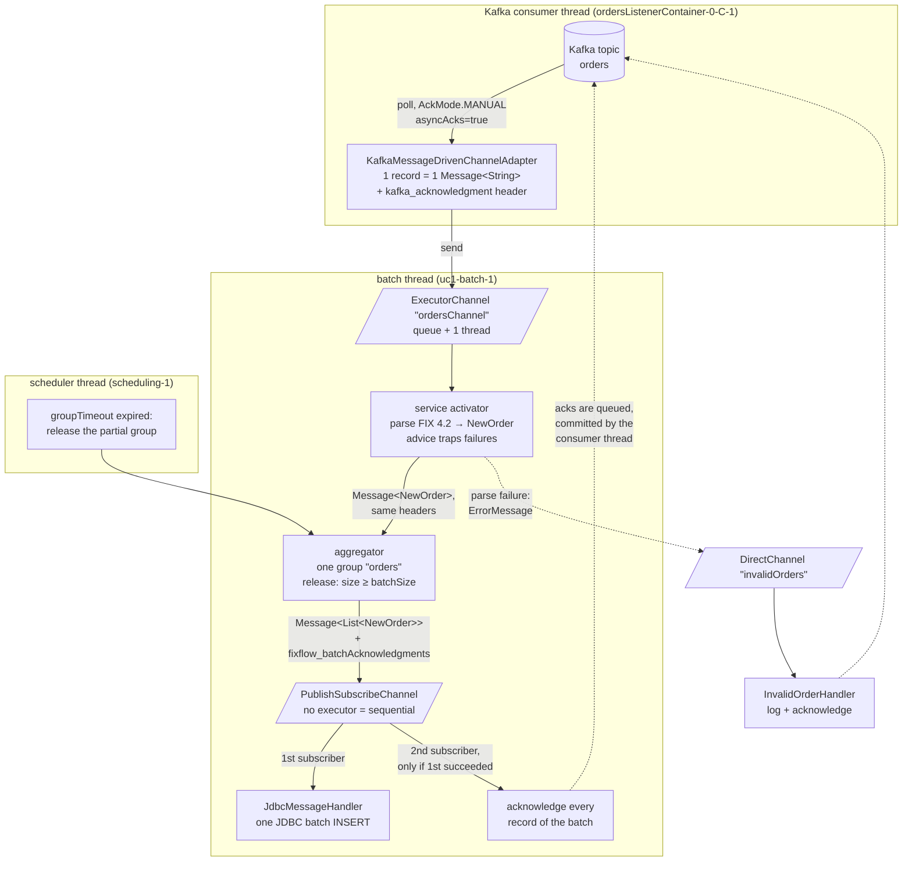
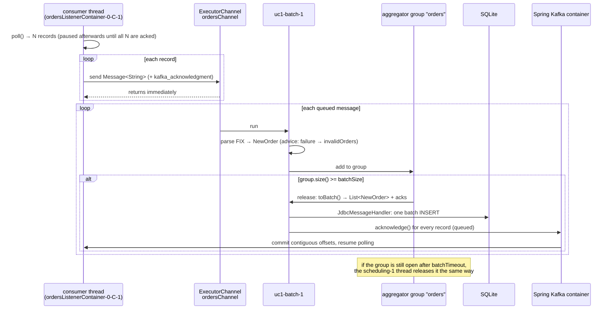

# How `OrdersFlowConfiguration` builds and runs the flow

This package is use case 1 with Spring Integration: FIX orders from Kafka, batched asynchronously, inserted into
SQLite with one JDBC batch, acknowledged to Kafka only after the insert. All of it is wired in
[`OrdersFlowConfiguration`](OrdersFlowConfiguration.java). The class is short but dense, because it works at two
levels at once:

1. **Build time.** The `@Bean` methods produce ordinary Spring beans plus one `IntegrationFlow` object, which is a
   *description* of a pipeline. At startup Spring Integration reads that description and creates the real channels
   and endpoints as beans.
2. **Run time.** A `Message` (payload + headers) travels through those channels and endpoints, changing thread twice
   on the way.

Keep both levels apart while reading and the class becomes simple.

## The picture



Dashed lines are acknowledgments; they do not carry messages further down the flow.

## Vocabulary you need

| Term | Meaning here |
|---|---|
| `Message` | Immutable payload + headers. Every step creates a new message; headers are copied forward unless a step replaces them. |
| Channel | The pipe between two endpoints. `DirectChannel`: the sender's thread runs the receiver. `ExecutorChannel`: the sender enqueues, an executor thread runs the receiver. `PublishSubscribeChannel`: every subscriber gets the message. |
| Endpoint | The thing that consumes from a channel and does work: inbound adapter, service activator (`handle`), aggregator, outbound adapter. |
| `IntegrationFlow` DSL | `IntegrationFlow.from(...).x().y().get()`. Each DSL call becomes one endpoint, and between two consecutive endpoints the DSL silently creates a `DirectChannel` named `ordersFlow.channel#N` unless you insert a channel yourself with `.channel(...)`. |

## Build time: the beans and what they are for

| Bean | Type | Role |
|---|---|---|
| `fixMessageParser` | `FixMessageParser` (from `common`) | Parses and validates FIX 4.2 `35=D` strings. |
| `batchStats` | `BatchStats` | Counters for the integration test and the logs. |
| `ordersListenerContainer` | `ConcurrentMessageListenerContainer` | The Kafka consumer. Built by `ManualAckContainers.manualAsyncAck`: `AckMode.MANUAL` and `asyncAcks=true`, so records must be acknowledged explicitly and may be acknowledged from any thread. |
| `ordersBatchExecutor` | `ThreadPoolTaskExecutor`, 1 thread | Backs the `ExecutorChannel`. One thread means batches are inserted and acknowledged in arrival order. |
| `ordersBatchInsert` | `JdbcMessageHandler` | Spring Integration's JDBC outbound adapter. Given an `Iterable` payload it runs one `batchUpdate`; the `SqlParameterSourceFactory` maps each `NewOrder` to the named parameters of `OrderSql.INSERT`. |
| `invalidOrderAdvice` | `ExpressionEvaluatingRequestHandlerAdvice` | AOP-style wrapper around one endpoint. `trapException=true` swallows the exception, `failureChannelName` sends an `ErrorMessage` carrying the original message to `invalidOrders`. |
| `invalidOrderHandler` | `InvalidOrderHandler` | Poison-record policy: log, acknowledge, count. |
| `ordersFlow` | `IntegrationFlow` | The description of the main pipeline (below). |
| `invalidOrdersFlow` | `IntegrationFlow` | `from("invalidOrders").handle(invalidOrderHandler)`: a `DirectChannel` created on demand plus one endpoint. |

Nothing in this table talks to Kafka or SQLite yet. That starts when Spring Integration's `IntegrationFlowBeanPostProcessor`
walks the two `IntegrationFlow` beans, registers every channel and endpoint as a bean of its own (names such as
`ordersFlow.channel#0` and `ordersFlow.org.springframework.integration.config.ConsumerEndpointFactoryBean#1`), subscribes
each endpoint to its input channel, and finally starts the listener container.

## The DSL chain, step by step

```java
IntegrationFlow
    .from(Kafka.messageDrivenChannelAdapter(ordersListenerContainer, ListenerMode.record))   // 1
    .channel(MessageChannels.executor("ordersChannel", ordersBatchExecutor))                 // 2
    .handle(String.class, (fix, headers) -> parser.parseNewOrderSingle(fix),                 // 3
            e -> e.advice(invalidOrderAdvice).requiresReply(false))
    .aggregate(aggregator -> aggregator                                                      // 4
            .correlationStrategy(message -> "orders")
            .releaseStrategy(group -> group.size() >= props.batchSize())
            .groupTimeout(props.batchTimeout().toMillis())
            .sendPartialResultOnExpiry(true)
            .expireGroupsUponCompletion(true)
            .outputProcessor(OrdersFlowConfiguration::toBatch))
    .publishSubscribeChannel(pubSub -> pubSub                                                // 5
            .subscribe(flow -> flow.handle(ordersBatchInsert))
            .subscribe(flow -> flow.handle(message -> acknowledge(message, batchStats))))
    .get();                                                                                  // 6
```

**1. Source.** `Kafka.messageDrivenChannelAdapter` wraps the listener container in a `KafkaMessageDrivenChannelAdapter`.
`ListenerMode.record` means one `Message` per Kafka record: payload is the FIX string, headers include
`kafka_receivedTopic`, `kafka_receivedPartitionId`, `kafka_offset` and, because the container is in manual ack mode,
`kafka_acknowledgment`, an `Acknowledgment` object bound to that record. The adapter sends on the consumer thread.

**2. Hand-off.** `.channel(MessageChannels.executor(...))` inserts an `ExecutorChannel`. `send()` on the consumer thread
only enqueues a task and returns, so the consumer is free to poll again (or, with `asyncAcks`, to pause until the poll
is acknowledged). Everything after this line runs on `uc1-batch-1`. The channel also wraps the executor in an
`ErrorHandlingTaskExecutor`: an exception that escapes any later step lands on the global `errorChannel`, where
Spring Integration's default logger reports it.

**3. Parse.** A service activator. Its reply is a new message whose payload is the `NewOrder` and whose headers are
those of the request, so `kafka_acknowledgment` travels on. Two details matter:

- The advice wraps the call. On `FixParseException` it sends an `ErrorMessage` (payload: an exception that holds the
  original request as `failedMessage`) to `invalidOrders`, then returns `null` because `trapException` is set.
- A `null` reply from a service activator with `requiresReply(false)` simply ends the flow for that message. That is
  why this step is `handle` and not `transform`: a transformer is not allowed to reply with nothing.

**4. Batch.** `AggregatingMessageHandler` with the default in-memory `SimpleMessageStore`. Each setting answers one
question:

| Setting | Question it answers |
|---|---|
| `correlationStrategy(message -> "orders")` | Which group does this message belong to? Always the same one: there is a single rolling batch. |
| `releaseStrategy(group -> group.size() >= batchSize)` | When is the group complete? When it holds `batchSize` orders. Evaluated after every arrival, on the arriving thread. |
| `groupTimeout(ms)` | What if the batch never fills? A task is scheduled on the `taskScheduler` bean; when it fires, `sendPartialResultOnExpiry(true)` releases whatever is there, on the `scheduling-1` thread. |
| `expireGroupsUponCompletion(true)` | What happens to the group after release? It is removed, so the next order starts a fresh group. Without this, Spring Integration keeps the completed group and *discards* later messages that correlate to it. |
| `outputProcessor(toBatch)` | What does the released group become? `toBatch` builds one message: payload `List<NewOrder>`, header `fixflow_batchAcknowledgments` holding the `Acknowledgment` of every record. The default output processor would drop `kafka_acknowledgment` because its value differs per message, and the acks would be lost. |

**5. Insert, then acknowledge.** `.publishSubscribeChannel(...)` fans the batch message out to two subscribers. With no
executor configured the channel invokes them sequentially, on the releasing thread, in subscription order, and stops
at the first exception. That gives the ordering the requirement asks for:

1. `ordersBatchInsert` (`JdbcMessageHandler`) sees an `Iterable` payload and runs one JDBC `executeBatch()`.
2. `acknowledge(...)` reads `fixflow_batchAcknowledgments`, calls `acknowledge()` on each, records the batch size.

If the insert throws, the second subscriber never runs, nothing is acknowledged, and the records are redelivered after
a restart (the `INSERT OR IGNORE` statement makes that redelivery idempotent).

**6. `.get()`** returns the `IntegrationFlow` description that the post-processor turns into beans.

## Run time: one record end to end



## Which thread does what

| Thread | Work |
|---|---|
| `ordersListenerContainer-0-C-1` | Polls Kafka, creates one message per record, enqueues it on `ordersChannel`, later commits the acknowledged offsets. Never parses, never touches the database. |
| `uc1-batch-1` | Parses, adds to the group, and when the size condition fires: builds the batch, inserts, acknowledges. Also runs `InvalidOrderHandler`, because `invalidOrders` is a `DirectChannel`. |
| `scheduling-1` | Releases a partial group when `batchTimeout` expires, then runs the same insert and acknowledge steps. |

## Headers that carry state through the flow

| Header | Set by | Used by |
|---|---|---|
| `kafka_acknowledgment` | Kafka inbound adapter, one per record | `toBatch` collects them; `InvalidOrderHandler` uses it for poison records |
| `kafka_receivedTopic`, `kafka_receivedPartitionId`, `kafka_offset` | Kafka inbound adapter | `InvalidOrderHandler` log line |
| `fixflow_batchAcknowledgments` | `toBatch` (aggregator output) | `acknowledge(...)` after the insert |

## The poison-record path

A record that is not a valid FIX order (wrong `35=`, bad checksum, garbage) throws inside step 3. The advice turns that
into an `ErrorMessage` on `invalidOrders`; `InvalidOrderHandler` unwraps the original message from
`MessagingException.getFailedMessage()`, logs topic, partition and offset with the cause, and acknowledges it. The
acknowledgment is what keeps the partition moving: with `asyncAcks` the container commits a partition only up to its
first unacknowledged offset, so a never-acknowledged record would block every later commit on that partition.

## Why the acknowledgments can come from another thread

`asyncAcks=true` on the container is the enabler for the whole design. `Acknowledgment.acknowledge()` called on
`uc1-batch-1` or `scheduling-1` is queued; the consumer thread drains the queue, commits each partition up to its
first unacknowledged offset, and resumes polling once every record of the last poll is acknowledged. The details and
their consequences for batch sizing are in [docs/kafka-manual-ack-and-batching.md](../../../../../../../../../docs/kafka-manual-ack-and-batching.md).

## Things that look odd but are deliberate

- `handle` instead of `transform` for parsing: a transformer must reply, a service activator may not.
- `requiresReply(false)` on that step: without it the trapped failure is reported as `ReplyRequiredException`.
- `expireGroupsUponCompletion(true)`: with a constant correlation key, forgetting it silently drops every order after
  the first batch.
- A custom `outputProcessor`: the only way to keep the per-record acknowledgments across the aggregator.
- A pub/sub channel for "insert, then ack": sequential subscribers give ordering and failure short-circuiting for free.
- A one-thread executor: ordering per partition matters for offsets, and SQLite has a single writer anyway.
- `spring.integration.jdbc.initialize-schema: never` in `application.yml`: Spring Boot would otherwise try to create
  Spring Integration's JDBC message-store tables for SQLite, which do not exist.

## See it happen

Run the module with `logging.level.org.springframework.integration=DEBUG` and watch the auto-generated names go by:
`ordersFlow.channel#N` for the implicit channels, the `ConsumerEndpointFactoryBean#N` endpoints, and the thread name at
the end of each `Inserted and acknowledged a batch of ...` line, which tells you whether size or timeout released it.
