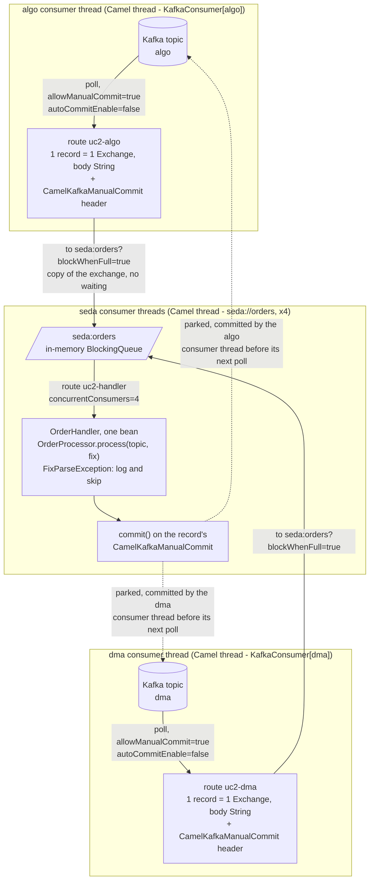
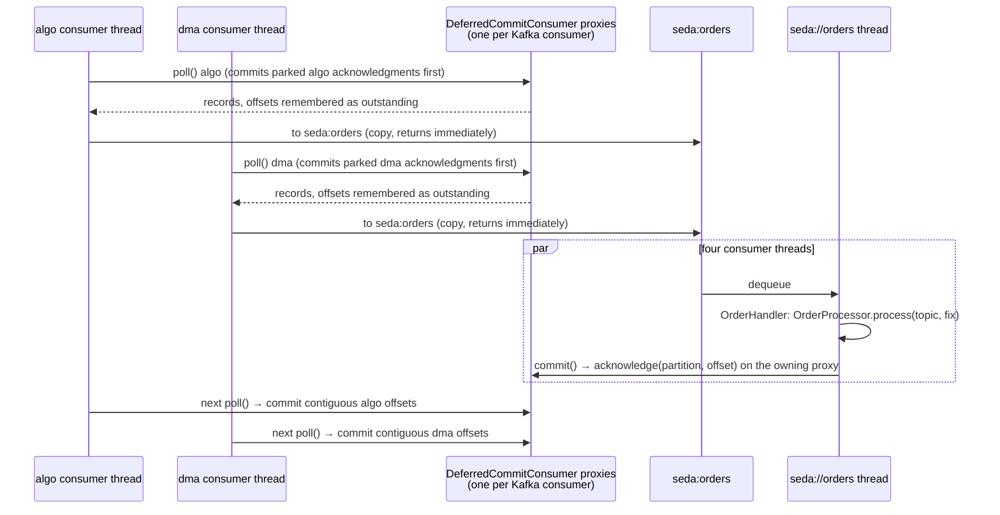

# How `OrderSourcesRoutes` builds and runs the routes

This module is use case 2 with Apache Camel: FIX orders arrive on two Kafka topics, `algo` and `dma`, are put on one
in-memory queue, handled asynchronously by a single handler class, and acknowledged back to the topic each record
came from. All of it is wired in [`OrderSourcesRoutes`](src/main/java/com/fixflow/usecase2/camel/OrderSourcesRoutes.java), with the work itself in
[`OrderHandler`](src/main/java/com/fixflow/usecase2/camel/OrderHandler.java).

As in the [use case 1 walkthrough](../../usecase1/apache-camel/README.md),
read the class at two levels: **build time**, where `configure()` appends three route definitions that Camel turns
into consumers and processors at startup, and **run time**, where an `Exchange` travels through them and changes
thread once. The new element here is that three routes meet on one `seda` queue.

## The picture



Dashed lines are acknowledgments; they do not carry exchanges further.

## Vocabulary you need

| Term | Meaning here |
|---|---|
| `seda` component | An in-memory queue endpoint. `to("seda:orders")` is the producer side and enqueues; `from("seda:orders")` is the consumer side and runs a route for every dequeued exchange, on its own threads. The queue is shared by name inside the `CamelContext`. |
| Exchange copy | The seda producer enqueues a copy of the exchange. Headers are copied by reference, so the `CamelKafkaManualCommit` object survives the hop. |
| `blockWhenFull` | Producer-side option: wait when the queue (1000 slots by default) is full instead of throwing. |
| `concurrentConsumers` | Consumer-side option: how many threads take from the queue. |
| Route id | `routeId("...")` names each route; Camel logs `Started uc2-algo (kafka://algo)` for each at startup. |

## Build time: the beans and what they are for

| Bean | Type | Role |
|---|---|---|
| `orderSourcesRoutes` | `OrderSourcesRoutes` (`@Component`, a `RouteBuilder`) | Discovered by Camel Spring Boot; its `configure()` defines the three routes. |
| `orderSourcesProperties` | `OrderSourcesProperties` | Topics, group id, handler threads, consumer count (`fixflow.sources.*`). |
| `fixMessageParser` | `FixMessageParser` (from `common`) | Parses and validates FIX 4.2 `35=D` strings. Declared in the nested `Beans` configuration. |
| `orderProcessor` | `OrderProcessor` (from `common`) | The framework-neutral business logic shared with the Spring Integration demo: parse, count per source topic, remember the thread names. |
| `orderHandler` | `OrderHandler` | The one handler class of the use case, wrapping `OrderProcessor` with the Camel-specific parts: reading the topic header and committing. |
| `deferredCommitKafkaClientFactory`, `deferredKafkaManualCommitFactory` | from `camel-kafka-support` | Imported by the application class and referenced by `camel.component.kafka.*` in `application.yml`; they make `commit()` safe from the seda threads. |

There is no `DataSource` in this module: nothing is persisted.

At startup Camel calls `configure()`, reifies the three definitions, creates one Kafka consumer per Kafka route
through the client factory (so each consumer is a deferred-commit proxy), creates the seda queue and its four consumer
threads, and logs `Routes startup (total:3)`.

## The three routes, step by step

```java
from(kafkaUri(props.algoTopic()))                                                   // 1
        .routeId("uc2-algo")
        .to(ORDERS_QUEUE + "?blockWhenFull=true");                                  // 2

from(kafkaUri(props.dmaTopic()))                                                    // 1
        .routeId("uc2-dma")
        .to(ORDERS_QUEUE + "?blockWhenFull=true");                                  // 2

from(ORDERS_QUEUE + "?concurrentConsumers=" + props.handlerThreads())               // 3
        .routeId("uc2-handler")
        .process(orderHandler);                                                     // 4
```

**1. Two sources, same shape.** `kafkaUri(topic)` builds
`kafka:<topic>?groupId=...&consumersCount=1&autoOffsetReset=earliest&autoCommitEnable=false&allowManualCommit=true&pollTimeoutMs=250`.
Each route has its own consumer thread and its own `KafkaConsumer`; both use the group id from
`fixflow.sources.group-id` and each commits only its own topic's partitions. Every record becomes one exchange with
the FIX text as body and the headers `kafka.TOPIC`, `kafka.PARTITION`, `kafka.OFFSET` and `CamelKafkaManualCommit`,
the last one bound to the consumer that polled the record. The broker address and the two factories come from the
component-level settings in `application.yml`.

**2. Enqueue.** `.to("seda:orders?blockWhenFull=true")` is the only step of both Kafka routes. The exchange is
InOnly, so the seda producer enqueues a copy and returns without waiting for the handler; the consumer thread goes
straight back to polling. If the queue is full, `blockWhenFull=true` makes the consumer thread wait, which is the
back-pressure of this design.

**3. Dequeue on worker threads.** `from("seda:orders?concurrentConsumers=4")` starts four threads named
`Camel (camel-1) thread #N - seda://orders`, each taking exchanges from the queue and running the handler route.
Records from `algo` and `dma` are interleaved across them.

**4. Handle.** `OrderHandler.process(exchange)`:

1. read the source topic from `kafka.TOPIC`;
2. `orderProcessor.process(topic, body)`, which parses and counts;
3. on `FixParseException` log topic, partition, offset and cause, and fall through;
4. `KafkaManualCommits.commit(exchange)`, that is `commit()` on the `CamelKafkaManualCommit` header.

Step 4 runs for valid and invalid orders alike, so a poison record never blocks its partition. The commit handle
belongs to the `algo` or the `dma` consumer, so the acknowledgment goes back to the topic the record came from without
any routing logic in the handler.

## Run time: one record from each topic



## Which thread does what

| Thread | Work |
|---|---|
| `Camel (camel-1) thread #N - KafkaConsumer[algo]` | Polls `algo`, enqueues each record on `seda:orders`, and commits the parked `algo` acknowledgments before every poll. Never parses. |
| `Camel (camel-1) thread #N - KafkaConsumer[dma]` | The same for `dma`. |
| `Camel (camel-1) thread #N - seda://orders` (four of them) | Run `OrderHandler`: parse, count, log, commit. |

`OrderProcessor.threadNames()` records the handler threads; the integration test asserts that every name contains
`seda://orders`, proving that no record was processed on a consumer thread.

## Headers that carry state

| Header | Set by | Used by |
|---|---|---|
| `CamelKafkaManualCommit` | the Kafka consumer that polled the record, through the deferred factory | `OrderHandler`, to acknowledge to the right topic |
| `kafka.TOPIC` | Kafka consumer | `OrderHandler`, as the source key for `OrderProcessor` counters and logs |
| `kafka.PARTITION`, `kafka.OFFSET` | Kafka consumer | the poison-record log line |

## The poison-record path

There is no `onException` in this builder: `OrderHandler` is the last step of the handler route, so it decides for
itself. It catches `FixParseException`, logs, and still commits. Any other exception is not caught; Camel's default
error handler logs it, the exchange fails, and the record stays unacknowledged. The deferred-commit proxy then commits
that partition only up to the failed record, so it is redelivered after a restart.

## Why the commits can come from the seda threads

They cannot, with Camel alone: a `KafkaConsumer` may only be used by the thread that polls it, and Camel's Kafka
component documents that commits must happen on the consumer thread. `application.yml` therefore points the component
at the two factories from `camel-kafka-support`: the client factory wraps each consumer in `DeferredCommitConsumer`,
which remembers the offsets returned by every `poll()` and commits each partition up to its first unacknowledged
offset before the next `poll()`, and the commit factory hands the route `CamelKafkaManualCommit` values whose
`commit()` only marks the offset as acknowledged. Each proxy belongs to one consumer, so an `algo` record's handle
updates the `algo` proxy and a `dma` record's handle the `dma` proxy. Details, and the comparison with Spring
Kafka's built-in `asyncAcks`, in [docs/kafka-manual-ack-and-batching.md](../../docs/kafka-manual-ack-and-batching.md).

## Things that look odd but are deliberate

- Producer options (`blockWhenFull`) on the `to` side and consumer options (`concurrentConsumers`) on the `from`
  side: seda endpoints referencing the same queue must not disagree on the queue itself (`size`), so each side only
  carries what applies to it.
- `blockWhenFull=true`: the default is to throw when the 1000-slot queue is full, which would fail the Kafka route.
- One `OrderHandler` bean shared by all four seda threads: Spring creates it once, and `OrderProcessor` is
  thread-safe.
- The handler commits inside `process`: the requirement is "after processed by the handler, ack", and keeping both in
  one method makes the ordering obvious.
- No `DataSource`, no `sql` starter, no Camel `bean` binding: the handler is a `Processor`, the simplest contract.
- `pollTimeoutMs=250`: a short idle poll keeps the commit latency of parked acknowledgments low.

## Same use case, the other framework

| Step | Here (Camel) | Spring Integration |
|---|---|---|
| Two sources | two routes ending in `.to("seda:orders")` | two containers, two one-step flows ending in `.channel("orders")` |
| In-memory hand-off | `seda:orders`, a `BlockingQueue` with `concurrentConsumers` | `PublishSubscribeChannel` with a `ThreadPoolTaskExecutor` |
| Handler | `OrderHandler implements Processor` | `OrderHandler implements MessageHandler` |
| Ack to the right topic | `CamelKafkaManualCommit` bound to the polling consumer | `kafka_acknowledgment` bound to the polling container |
| Ack from a worker thread | custom proxy in `camel-kafka-support` | built-in `asyncAcks` |
| Back-pressure | `blockWhenFull=true` on the seda producers | consumer paused until its poll is acknowledged |

## See it happen

Start the module and watch `Routes startup (total:3)` list `uc2-algo`, `uc2-dma` and `uc2-handler`. Send orders to
`algo` and `dma` with the demo producer and read the log: each
`[algo] processed NewOrder[...] on Camel (camel-1) thread #2 - seda://orders` line names the source topic and the
handler thread, and `Skipping invalid order from dma-1@7` lines show the poison path. The `KafkaConsumer[...]` threads
never appear in those lines.
