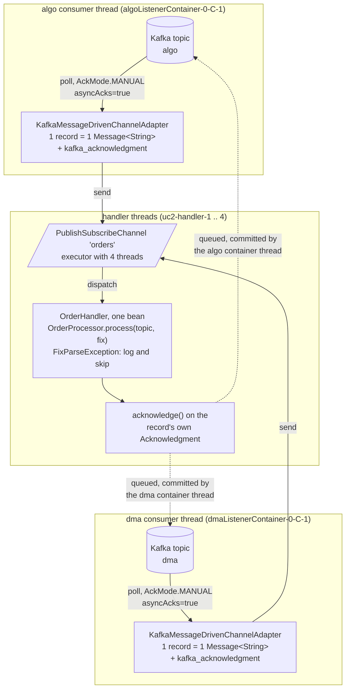
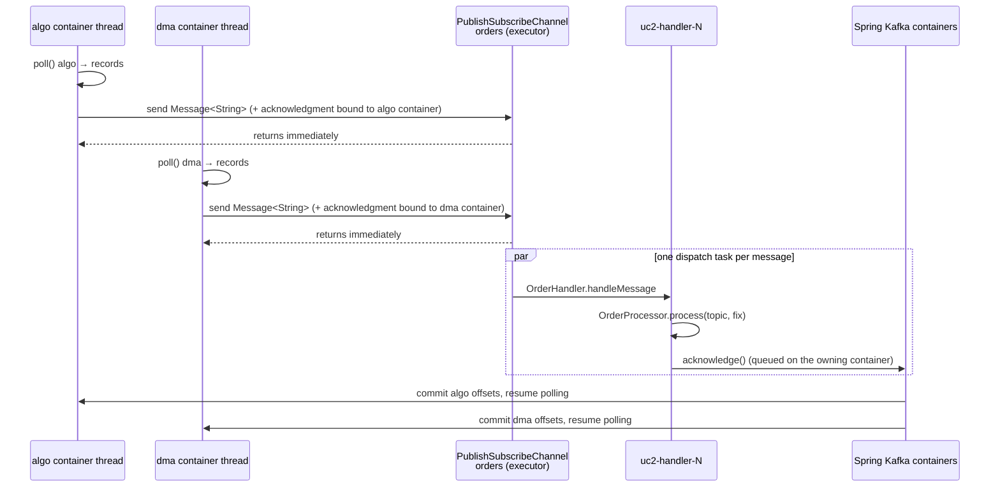

# How `OrderSourcesConfiguration` builds and runs the flows

This module is use case 2 with Spring Integration: FIX orders arrive on two Kafka topics, `algo` and `dma`, are
published to one in-memory channel, handled asynchronously by a single handler class, and acknowledged back to the
topic each record came from. All of it is wired in [`OrderSourcesConfiguration`](src/main/java/com/fixflow/usecase2/si/OrderSourcesConfiguration.java),
with the work itself in [`OrderHandler`](src/main/java/com/fixflow/usecase2/si/OrderHandler.java).

As in the [use case 1 walkthrough](../../usecase1/spring-integration/README.md),
read the class at two levels: **build time**, where `@Bean` methods produce beans and three `IntegrationFlow`
descriptions that Spring Integration turns into channels and endpoints at startup, and **run time**, where a
`Message` travels through them and changes thread once. The new element here is that three flows meet on one
channel that is declared as an ordinary bean.

## The picture



Dashed lines are acknowledgments; they do not carry messages further.

## Vocabulary you need

| Term | Meaning here |
|---|---|
| `PublishSubscribeChannel` | A channel that delivers every message to every subscriber. Given an executor, it dispatches on the executor's threads instead of the sender's. There is one subscriber in this use case; a second one (an audit trail, say) would receive the same messages. |
| Message-driven adapter | The Kafka inbound endpoint that turns records into messages and sends them; it is driven by the listener container's thread, not polled. |
| `MessageHandler` | The simplest endpoint contract: `handleMessage(Message<?>)`, no reply. `OrderHandler` implements it directly. |
| Channel by name | `.channel("orders")` and `IntegrationFlow.from("orders")` resolve the bean called `orders`. Because that bean exists, the DSL reuses it instead of creating a `DirectChannel`. |

## Build time: the beans and what they are for

| Bean | Type | Role |
|---|---|---|
| `fixMessageParser` | `FixMessageParser` (from `common`) | Parses and validates FIX 4.2 `35=D` strings. |
| `orderProcessor` | `OrderProcessor` (from `common`) | The framework-neutral business logic shared with the Camel demo: parse, count per source topic, remember the thread names. |
| `orderHandler` | `OrderHandler` | The one handler class of the use case, wrapping `OrderProcessor` with the Spring-specific parts: reading the topic header and acknowledging. |
| `algoListenerContainer` | `ConcurrentMessageListenerContainer` | Kafka consumer for the `algo` topic, `AckMode.MANUAL` + `asyncAcks=true` (via `ManualAckContainers`). |
| `dmaListenerContainer` | `ConcurrentMessageListenerContainer` | The same for `dma`. Both use the group id from `fixflow.sources.group-id`; each commits only its own topic's partitions. |
| `orderHandlerExecutor` | `ThreadPoolTaskExecutor`, `handlerThreads` threads | Backs the channel; thread names `uc2-handler-N`. |
| `orders` | `PublishSubscribeChannel` | The in-memory meeting point of the three flows, declared with `@Bean(ORDERS_CHANNEL)`. |
| `algoInboundFlow`, `dmaInboundFlow` | `IntegrationFlow` | Adapter → `orders`. |
| `orderHandlerFlow` | `IntegrationFlow` | `orders` → `OrderHandler`. |

At startup Spring Integration's `IntegrationFlowBeanPostProcessor` registers the two adapters and the handler endpoint
as beans, subscribes the handler endpoint to `orders`, and starts both listener containers. Each container creates
one consumer thread (`concurrency` = 1) named after the container bean.

## The three flows, step by step

```java
IntegrationFlow                                                                                  // algoInboundFlow
        .from(Kafka.messageDrivenChannelAdapter(algoListenerContainer, ListenerMode.record))     // 1
        .channel(ORDERS_CHANNEL)                                                                 // 2
        .get();

IntegrationFlow                                                                                  // dmaInboundFlow
        .from(Kafka.messageDrivenChannelAdapter(dmaListenerContainer, ListenerMode.record))      // 1
        .channel(ORDERS_CHANNEL)                                                                 // 2
        .get();

IntegrationFlow.from(ORDERS_CHANNEL)                                                             // orderHandlerFlow
        .handle(orderHandler)                                                                    // 3
        .get();
```

**1. Two sources, same shape.** Each adapter emits one `Message<String>` per record with the FIX text as payload and
the headers `kafka_receivedTopic`, `kafka_receivedPartitionId`, `kafka_offset` and `kafka_acknowledgment`. The
`Acknowledgment` object is created by the container that polled the record, which is what later routes the
acknowledgment to the right topic. The send happens on that container's consumer thread.

**2. Publish.** `.channel("orders")` ends both inbound flows on the shared `PublishSubscribeChannel`. Because the
channel has an executor, `send()` only enqueues a dispatch task and returns; the consumer thread is free again (and,
with `asyncAcks`, pauses until every record of its poll has been acknowledged). The channel wraps the executor in an
`ErrorHandlingTaskExecutor`, so an exception escaping the handler goes to the global `errorChannel`.

**3. Handle.** `OrderHandler.handleMessage` runs on a `uc2-handler-N` thread:

1. read the source topic from `kafka_receivedTopic`;
2. `orderProcessor.process(topic, fix)`, which parses and counts;
3. on `FixParseException` log topic, partition, offset and cause, and fall through;
4. `KafkaAcks.acknowledge(message)`.

Step 4 runs for valid and invalid orders alike, so a poison record never blocks its partition. The `Acknowledgment`
belongs to the `algo` or the `dma` container, so the commit goes back to the topic the record came from without any
routing logic in the handler.

## Run time: one record from each topic



## Which thread does what

| Thread | Work |
|---|---|
| `algoListenerContainer-0-C-1` | Polls `algo`, creates one message per record, sends it to `orders`, later commits the acknowledged `algo` offsets. Never parses. |
| `dmaListenerContainer-0-C-1` | The same for `dma`. |
| `uc2-handler-1` .. `uc2-handler-4` | Run `OrderHandler`: parse, count, log, acknowledge. Records from both topics are interleaved across these threads. |

`OrderProcessor.threadNames()` records the handler threads; the integration test asserts that every name starts
with `uc2-handler-`, proving that no record was processed on a consumer thread.

## Headers that carry state

| Header | Set by | Used by |
|---|---|---|
| `kafka_acknowledgment` | the adapter of the container that polled the record | `OrderHandler`, to acknowledge to the right topic |
| `kafka_receivedTopic` | adapter | `OrderHandler`, as the source key for `OrderProcessor` counters and logs |
| `kafka_receivedPartitionId`, `kafka_offset` | adapter | the poison-record log line |

## The poison-record path

There is no advice or error channel in this use case: `OrderHandler` is the last step of the flow, so it can decide
for itself. It catches `FixParseException`, logs, and still acknowledges. Any other exception is not caught; it
reaches `errorChannel` through the executor's error handler, is logged by Spring Integration's default error logger,
and the record stays unacknowledged, which with `asyncAcks` pauses its partition until the application is restarted
and the record redelivered.

## Why the acknowledgments can come from the handler threads

`asyncAcks=true` on both containers. `acknowledge()` called on a handler thread is queued; the owning container's
consumer thread drains the queue, commits each partition up to its first unacknowledged offset, and resumes polling
once every record of its last poll is acknowledged. Details in
[docs/kafka-manual-ack-and-batching.md](../../docs/kafka-manual-ack-and-batching.md).

## Things that look odd but are deliberate

- The channel is a `@Bean` rather than created inside a flow: three flows share it, so it is declared once and
  referenced by name.
- `PublishSubscribeChannel` rather than `ExecutorChannel`: the requirement says "published", and a pub/sub channel
  lets a second subscriber be added without touching the inbound flows. With one subscriber the two behave the same.
- Two containers with the same group id: one consumer group whose two members subscribe to different topics. Kafka
  assigns each topic's partitions only to the member subscribed to it, and each container commits its own offsets.
- The handler catches `FixParseException` itself: a `MessageHandler` has no reply and nothing downstream, so the
  advice-and-failure-channel construction of use case 1 is unnecessary here.
- `OrderHandler` acknowledges inside `handleMessage`: the requirement is "after processed by the handler, ack", and
  keeping both in one method makes the ordering obvious.
- `max-poll-records: 100` with four handler threads: with `asyncAcks` a consumer pauses until its poll is fully
  acknowledged, so the poll size bounds how much work is in flight per topic.

## Same use case, the other framework

| Step | Here (Spring Integration) | Apache Camel |
|---|---|---|
| Two sources | two containers, two one-step flows ending in `.channel("orders")` | two routes ending in `.to("seda:orders")` |
| In-memory hand-off | `PublishSubscribeChannel` with a `ThreadPoolTaskExecutor` | `seda:orders`, a `BlockingQueue` with `concurrentConsumers` |
| Handler | `OrderHandler implements MessageHandler` | `OrderHandler implements Processor` |
| Ack to the right topic | `kafka_acknowledgment` bound to the polling container | `CamelKafkaManualCommit` bound to the polling consumer |
| Ack from a worker thread | built-in `asyncAcks` | custom proxy in `camel-kafka-support` |
| Back-pressure | consumer paused until its poll is acknowledged | `blockWhenFull=true` on the seda producers |

## See it happen

Start the module, send orders to `algo` and `dma` with the demo producer, and read the log: each
`[algo] processed NewOrder[...] on uc2-handler-3` line names the source topic and the handler thread, and
`Skipping invalid order from dma-1@7` lines show the poison path. The container threads never appear in those lines.
